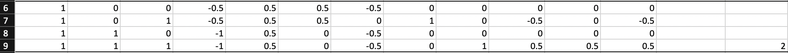
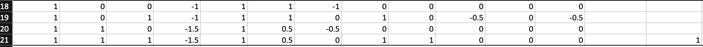
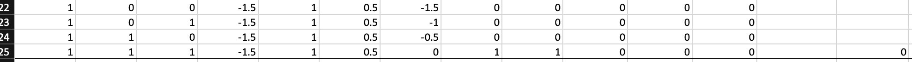

## Single Artificial Neuron in Excel
I first struggled to understand how exactly artificial neurons learn their precise weights through feed-forward and backpropagation. 

I found the best way to understand this algorithm was creating AND and XOR logical neurons and preforming each iteration with Excel functions. These functions were very simple with no hidden layers or bais.

### AND Neuron

This logical AND function should return 0 unless all features are 1.
 

Iteration 0 of logical AND neuron.

- X\_0, X\_1, X\_2 represent features for each data point.
- W\_0, W\_1, W\_2 represent the initial weights of each node. These all start at 1 instead of using random assignment.
- The net is the total sum of the output node before the activation function is applied.
- Y\_Output is the output of this node after applying the step activation function as (=IF(G2>=0,1,0).
- Desired shows the target value for that data point, row 2 has a target value of 0 because not all features are 1. 
- Change W\_0, Change W\_1, Change W\_2 represent how each weight is changed based on the error of Y_Output. This function is defined as (=$M$2\*A2\*(I2-H2)) for W\_0. This change is added to the weights in the next iteration. 
- Learning rate is a constant value for how much a weight can change at each iteration.
- Error is calcuated using the sum of squared estimates formula defined as (=(I2-H2)^2 + (I3-H3)^2 +(I4-H4)^2 + (I5-H5)^2).

This process is continued, with weights being updated, until the Error is 0:

Iteration 1 of logical AND neuron.

Iteration 2 of logical AND neuron.

Iteration 3 of logical AND neuron.

Iteration 4 of logical AND neuron.

Iteration 5 of logical AND neuron.

The Error is now 0 and this function only returns 1 when all three features are 1.

### XOR Neuron
This same process was repeated for a logical XOR function. This function should only return 1 when at least one feature is 1, but not all three.

